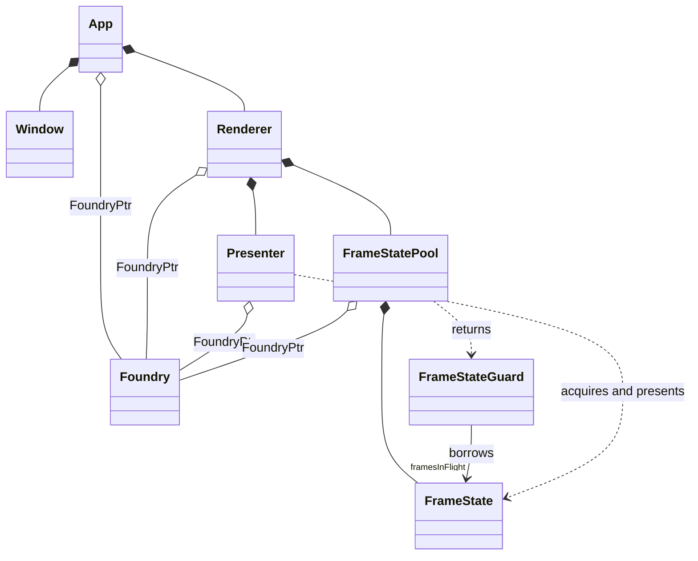
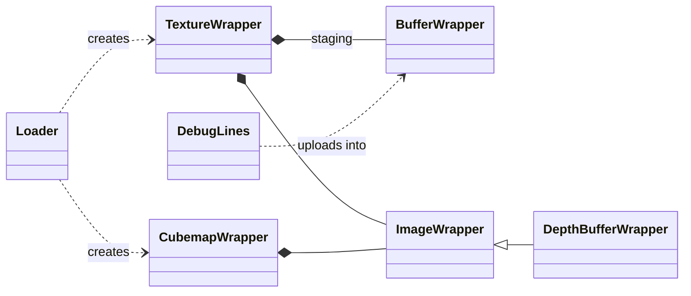

# Spock

## Design Goals

- Allow rapid iteration: minimal setup for new projects, runtime shader compilation.
- Cross platform: Linux, Windows and MacOS currently supported.
- Thin abstraction: use Vulkan_Hpp RAII to simplify Vulkan API but not hide it.

## Architectural Overview

`Spock` is organized as a layered rendering framework rather than a single monolithic engine. The reusable framework code lives under `spock/`, while example applications live under `samples/` and a smaller geometry-focused utility library lives under `geo/`.

I hope that this structure makes the project easier to use: the framework is intended to lower the barriers entry to Vulkan, especially around areas that can be complicated such as device selection and frame synchronisation.  The Vulkan_Hpp RAII wrappers have helped me greatly, and I have tried to keep them accessible whereever possible.

Each of the samples demonstrates a focused use case such as a spinning cube, instancing, shader hot-reloading and applying textures.  I am currently working through more complex examples such as Gaussian splatting and will add more.

### Core classes

The framework is built around a handful of classes, each owning one part of the Vulkan lifecycle:

- `App` — owns the `vk::raii::Context` and `vk::raii::Instance`, the `Window`, the `Foundry` and the `Renderer`. `run()` drives a fixed-timestep main loop: poll events, call `update()`, render a frame, then detect window resizes and tell the renderer to rebuild. Subclasses implement `createRenderer()` and `update()`, and can override `createFoundry()` to request extra queues, extensions or device features.
- `Window` — owns the platform window and its input state (cursor, mouse buttons, scroll wheel). GLFW is an implementation detail confined to `window.cpp`.
- `Foundry` — owns the physical device, surface, logical device, queues (graphics, present, compute, transfer) and their command pools. It selects the physical device by scoring against the requested queues, extensions and preferred device type, and creates swapchains for the surface.
- `Renderer` — owns the render pass, optional depth buffer, `Presenter` and `FrameStatePool`. `renderFrame()` acquires a frame, begins the render pass, sets the viewport and scissor, then calls the pure virtual `render(FrameState&)` for the subclass to record its draw commands. `resizeWindow()` tears everything down and rebuilds it at the new extent.
- `Presenter` — owns the swapchain, its image views, the framebuffers and the per-image render-finished semaphores. `acquireFrame()` and `presentFrame()` handle swapchain image acquisition, queue submission and presentation for a `FrameState`.
- `FrameState` - the set of per-frame resources (command buffer, semaphore, fence, etc) for one frame in flight.  To extend, subclass `FrameState` and add per-frame resources such as dynamic vertex buffers or descriptor sets.  Then set the `m_createFrameFunc` function in your renderer's constructor to create this new class.
- `FrameStatePool` - owns a fixed array of `FrameState` and rotates through them as the frames are rendered; `acquireFrame()` waits on the frame's fence so the CPU never touches resources that the GPU is still using. The `FrameStateGuard` returns the frame to the pool when it goes out of scope, even if recording throws.



### Frame lifecycle

Each iteration of `App::run()` does the following:

1. `Window::pollEvents()` and `App::update()` (the subclass updates its simulation and camera).
2. `Renderer::renderFrame()` lazily creates the `FrameStatePool` on the first frame (or after a resize), then borrows the next `FrameState`, waiting on its fence.
3. `Presenter::acquireFrame()` acquires the next swapchain image, signalling the frame's semaphore.
4. A `CommandBufferWrapper` begins the command buffer and render pass; the viewport and scissor are set from the swapchain extent; `render(frame)` records the subclass's commands; the wrapper ends the render pass and command buffer.
5. `Presenter::presentFrame()` submits the command buffer to the graphics queue, signalling the frame's fence, and presents the image on the present queue.
6. Back in `App`, a changed framebuffer size or a suboptimal/out-of-date result triggers `Renderer::resizeWindow()`, which waits for the GPU, rebuilds the swapchain (handing the old one over to the new `Presenter`), depth buffer, render pass, framebuffers and frame pool.

### Resource wrappers and helpers

Alongside the core classes, the library provides thin RAII wrappers over Vulkan resources and a set of free functions:



| Header | Contents |
|---|---|
| `creators.hpp` | Free functions that build Vulkan objects with sensible defaults: `createInstance`, `createRenderPass`, `createGraphicsPipeline`, `createComputePipeline`, `createDescriptorSetLayout`, `createDescriptorPool`, `createFramebuffers`, `createSampler`, `updateDescriptorSets`. |
| `shaders.hpp` | `compileShader` (GLSL source to SPIR-V via glslang at runtime) and `loadShader` (from a file). |
| `helpers.hpp` | Low-level helpers: `oneTimeSubmit`, `setImageLayout`, `allocateDeviceMemory`, `copyToDevice`, `pushConstants`, surface format and present mode selection. |
| `math.hpp` | GLM configuration plus `Transform` (quaternion, translation, uniform scale), `f16` and random helpers. |
| `camera.hpp` | `OrbitCamera` and a `viewProjMatrix` convenience function. |
| `utils.hpp` | `checked_cast` and logging. |
| `types.hpp` | Forward declarations and the `FoundryPtr` alias; includes no Vulkan or GLM headers. |

## Samples

There are a set of samples which demonstrate functions of Vulkan and the framework. These will continue to be expanded.

- `cube` — a completely self-contained renderer: the cube geometry and both shaders are defined inline in the source, with no external asset or shader files to load.
- `quad` — an even simpler example: a single textured quad, useful as a basis for 2D samples.
- `shaderlab` — demonstrates automatic shader compilation and hot-reloading via `FileWatcher`. The default shaders implement a simple ShaderToy-like interface, where the fragment shader can be experimented with at runtime.
- `instancing` — renders a 16x16 grid of sprites. The vertex buffer contains a single quad and the instance buffer contains position and color data for each instance.
- `textured_cube` — extends `cube` by loading a PNG from disk with `Loader::texture` and sampling it through a combined image sampler.
- `textured_sphere` — generates a sphere by subdividing and normalising the faces of a cube, then projects a cubemap onto it using the normals.
- `debug_lines` — demonstrates `spock::DebugLines` and per-frame resources: 32 wireframe cubes orbit a sphere, with each frame in flight owning its own line vertex buffer.
- `compute` — sorts a buffer of random floats on the GPU using VkRadixSort compute shaders on the compute queue, and compares the result and timing against a CPU sort. Overrides `createFoundry()` to request a compute queue and the subgroup size control extension.
- `splat` — demonstrates instanced rendering and the use of uniform and storage buffers. It implements a basic form of 3D Gaussian Splatting, derived from the tutorial “3D Gaussian Splatting in a Weekend”.
- `video_player` — decodes a video file with FFmpeg and writes each YUV frame straight into persistently mapped, linearly tiled textures that the fragment shader converts to RGB. Only built when FFmpeg is found via `pkg-config`.

## Building

Example:

```bash
cmake -S . -B build
cmake --build build --target cube
cmake --build build --target splat
cmake --build build --target shaderlab
```

To create an optimized release build:

```bash
cmake -S . -B build-release -DCMAKE_BUILD_TYPE=Release
cmake --build build-release --config Release
```

CMake options:

- `SPOCK_BUILD_TESTS` (default `ON`) — build the `spock_tests` and `geo_tests` executables. Catch2 is fetched at configure time, so turn this off for an offline build.
- `VULKAN_HPP_USE_WAYLAND` (default `ON`) — on Linux, target Wayland instead of XCB.

The sample targets link against the static `spock` library so the reusable renderer code is compiled once and reused across demos.

## Geometry library

`geo` is a small standalone 2D/3D intersection-testing library, used for spatial queries such as triangle-vs-AABB overlap testing (e.g. for Sparse Voxel Octree generation from triangle meshes).

`geo3d::Intersect` provides four interchangeable triangle-vs-AABB tests, benchmarked in `geo/tests/geo_intersect3d_tests.cpp` (release build, ns/call):

| Scenario                                    | testAM | testSS | testNoBB | test |
|---------------------------------------------|--------|--------|----------|------|
| Edge crosses the box (the common case)      |  64ns  |  21ns  |   7ns    | 17ns |
| Box straddles the interior, no edge touch   |  69ns  |  32ns  |   28ns   | 38ns |
| Disjoint along the triangle's own normal    |  14ns  |  4ns   |   17ns   | 9ns  |

- `testAM` — the standard 13-axis SAT reference (Akenine-Möller); a correctness/performance baseline, not intended for production use.
- `testSS` — adapted from Schwarz-Seidel; fastest when queries are mostly disjoint.
- `testNoBB` — a novel early-exit algorithm, fastest when queries are mostly intersecting (e.g. SVO generation).
- `test` — `testNoBB` with an AABB precheck; a middle ground when disjoint queries are common.

See the comment above `Intersect::testNoBB` in `geo/src/intersect3d.cpp` for the full breakdown.

## Tests

The test suites live under `spock/tests` and `geo/tests` and use [Catch2](https://github.com/catchorg/Catch2) v3, which is downloaded automatically with `FetchContent` when `SPOCK_BUILD_TESTS` is `ON`. They build as the `spock_tests` and `geo_tests` executables and are registered with CTest.

Tests fall into two groups:
- Plain unit tests — pure logic, no GPU required: `camera_tests.cpp`, `foundry_tests.cpp` (queue family selection), `helpers_tests.cpp`, `math_tests.cpp`, `shaders_tests.cpp` (error paths), `utils_tests.cpp`, `wrappers_tests.cpp` (`VertexFormat`) and their `*_extended_tests.cpp` companions.
- GPU-backed integration tests, tagged `[gpu]`: `gpu_tests.cpp`, `renderer_tests.cpp` and `frame_state_tests.cpp`. These create a real, headless Vulkan instance and `Foundry` via `VK_EXT_headless_surface`, so no window or display is required. They skip themselves when no usable Vulkan device is available.

Build and run:

```bash
cmake -S . -B build
cmake --build build --target spock_tests geo_tests
./build/bin/spock_tests
./build/bin/geo_tests
```

To skip the GPU tests, for example on a machine without a Vulkan driver:

```bash
./build/bin/spock_tests "~[gpu]"
```

## Requirements

Installed on your system:
- CMake 3.15+
- C++20 compiler
- Vulkan SDK with Vulkan 1.4 headers (`createInstance` requests `VK_API_VERSION_1_4` by default)
- OpenGL development libraries
- TBB (Linux and MacOS only, for the parallel sort in the samples)
- FFmpeg (`libavformat`, `libavcodec`, `libavutil`, `libswscale`), optional; found via `pkg-config` and only needed for the `video_player` sample

Bundled as git submodules under `deps/` and built as part of the project — no separate installation needed:
- GLFW
- GLM
- glslang
- efsw
- stb (header-only, used by `Loader` for image decoding)
- tinygltf (checked out for future glTF loading, not yet used by the build)

Catch2 is fetched by CMake at configure time when the tests are enabled.

## Platform notes

- Windows builds use Win32 Vulkan platform definitions.
- Linux builds support XCB and Wayland selection via the `VULKAN_HPP_USE_WAYLAND` option (Wayland by default).
- MacOS builds use the Metal surface extension and enable portability enumeration so that MoltenVK is found.

### MacOS

MacOS requires the MoltenVK SDK for Vulkan support, which can be downloaded from the [lunarg](https://vulkan.lunarg.com/sdk/home) site.

The samples require TBB and oneDPL for parallel sort. These can be installed with brew:

```bash
brew install tbb onedpl
```

## Adding New Samples

1. Create a class derived from `spock::Renderer` that overrides `render(spock::FrameState &frame)` and does whatever pipeline/buffer setup it needs in its constructor. The base constructor takes the `FoundryPtr`, window extents, clear color and clear depth/stencil values, and an optional flag to disable the depth buffer. Use `m_renderPass` from the base class when creating pipelines.
2. If the renderer needs per-frame resources (dynamic buffers, descriptor sets), derive a class from `spock::FrameState` to hold them and assign `m_createFrameFunc` in the renderer's constructor. The pool creates one instance per frame in flight and hands the matching one to `render()`.
3. Create a class derived from `spock::App` that overrides `createRenderer()` (to construct your renderer from `m_foundry` and `m_window.extents()`) and `update()` (called once per frame before rendering). Override `createFoundry()` if you need additional queues, device extensions or features.
4. Give it a `main()` that calls `spock::runApp<YourApp>(...)` with your app's constructor arguments — it constructs the app, runs it, and reports any exception that escapes.
5. Add a new executable target in `samples/CMakeLists.txt` via `add_sample_target(your_sample src/your_sample.cpp)`.
